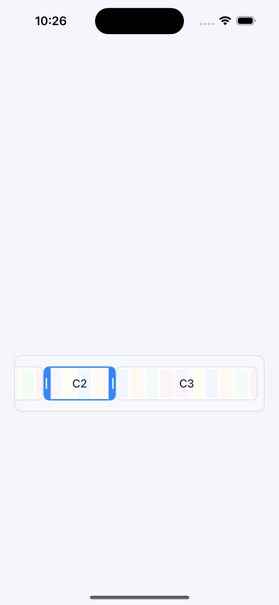

# 🎞️ Video Clip Trimmer Timeline UI (Swift – CapCut Style)

This repository provides a fully interactive, customizable **video clip trimmer timeline UI** component built with **UIKit** and **AVFoundation**, inspired by modern video editors like **CapCut** and **VN Editor**.

It enables users to scroll through a timeline of video clips and trim them interactively using draggable left and right handles. This UI component is ideal for integrating a native iOS video editing experience in your apps.

---

## ✨ Features

- 🔹 Trimmable clip views with left/right draggable handles  
- 🔹 Smooth ripple-trim effect on both ends of the clip  
- 🔹 Real-time resizing with visual updates  
- 🔹 Scrollable timeline using `UIScrollView`  
- 🔹 Supports multiple clips side by side  
- 🔹 Auto-selection, snapping, and deselection handling  
- 🔹 Lightweight and UIKit-only – no external dependencies  

---

## 📷 Preview

| Trim Bar | Trimming Handles | Multiple Clips |
|----------|------------------|----------------|
|  |  |  |

---

## 🧰 Technologies Used

- `UIKit`  
- `AVFoundation`  
- Custom gesture recognizers (tap + pan)  
- Dynamic layout using manual `frame` updates  

---

## 🛠️ How It Works

### Components

- `VideoClipViewHera`: Represents an individual clip with trim handles, a label, and a simulated mini timeline.  
- `ViewController`: Hosts a horizontally scrollable timeline and manages clip layout, interaction, and gesture logic.

### Interaction Flow

- Tap to select a clip  
- Drag left or right handle to trim that edge  
- The clip view resizes in real time  
- Other clips adjust dynamically ("ripple effect")  
- Scroll view content size updates automatically  

---

## 📦 Getting Started

1. Copy `VideoClipViewHera.swift` and `ViewController.swift` into your Xcode project.  
2. Add your own video assets or clip data if needed.  
3. Run the project and interact with the timeline UI.  

---

## 🔍 Example Code Snippet

```swift
let clip = VideoClipViewHera(frame: clipFrame, clipId: 0, title: "Clip 1")
clip.isSelected = true
timelineContentView.addSubview(clip)
